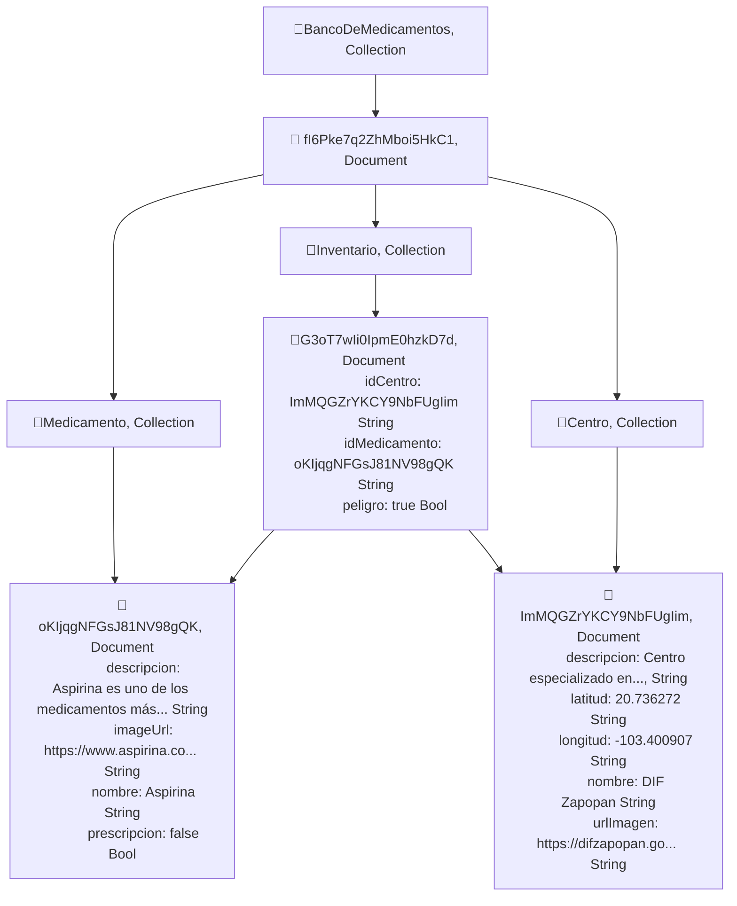

```mermaid
flowchart TD
  A["📕BancoDeMedicamentos, Collection"] --> B["📄 fI6Pke7q2ZhMboi5HkC1, Document"]
  B --> C["📕Medicamento, Collection"]
  B --> D["📕Inventario, Collection"]
  B --> E["📕Centro, Collection"]
  C --> F["📄oKIjqgNFGsJ81NV98gQK, Document
            descripcion: Aspirina es uno de los medicamentos más... String
            imageUrl: https://www.aspirina.co... String
            nombre: Aspirina String
            prescripcion: false Bool"]
  E --> G["📄ImMQGZrYKCY9NbFUgIim, Document
          descripcion: Centro especializado en..., String
          latitud: 20.736272 String
          longitud: -103.400907 String
          nombre: DIF Zapopan String
          urlImagen: https://difzapopan.go... String"]
  D --> H["📄G3oT7wIi0IpmE0hzkD7d, Document 
          idCentro: ImMQGZrYKCY9NbFUgIim String
          idMedicamento: oKIjqgNFGsJ81NV98gQK String
          peligro: true Bool"]
  H --> F
  H --> G
  
```

[Informacion](https://github.blog/2022-02-14-include-diagrams-markdown-files-mermaid/) de como hice el diagrama
